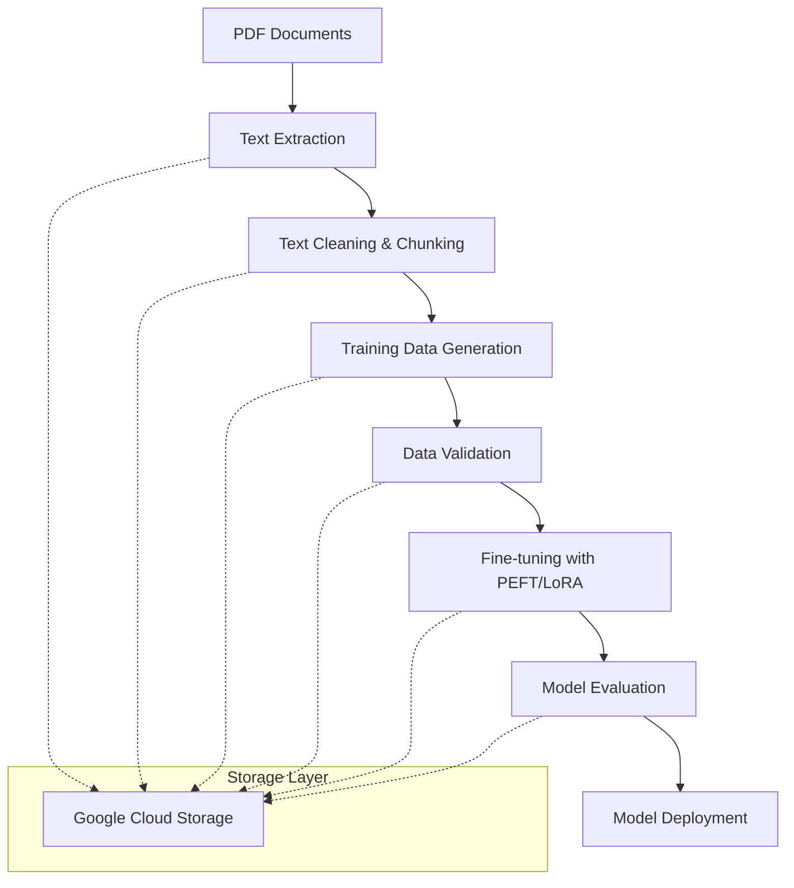

# PLANNING.md - Gemini PDF Fine-tuning Pipeline

## Project Overview

We're building a streamlined pipeline to fine-tune Google's Gemini models on PDF documentation. This pipeline will enable our AI startup to create specialized models that understand and can answer questions about specific documentation.

## Architecture Principles

1. **Simplicity First**: Minimize complexity and dependencies
2. **Modularity**: Independent components that can be developed and tested separately
3. **Scalability**: Start small but design for growth
4. **Reproducibility**: Ensure consistent results across runs
5. **Cost Efficiency**: Optimize for performance while managing cloud costs

## Technology Stack

### Core Technologies

- **Cloud Platform**: Google Cloud Platform (GCP)
- **ML Framework**: PyTorch (industry standard with excellent community support)
- **Orchestration**: Vertex AI Pipelines (fully managed, integrated with GCP)
- **Model**: Gemini Pro (best balance of capability and cost)
- **Language**: Python 3.10+ (for all components)

### Key Components

1. **PDF Processing**:
   - PyPDF2 for text extraction (simple, reliable)
   - Document AI for complex PDFs (when needed)

2. **Text Processing**:
   - Hugging Face Transformers for tokenization
   - NLTK for basic NLP tasks

3. **Training Data Preparation**:
   - JSONL format (standard for Vertex AI)
   - Question-Answer pair generation

4. **Fine-tuning**:
   - Parameter-Efficient Fine-Tuning (PEFT) with LoRA
   - Vertex AI Training Jobs

5. **Evaluation**:
   - ROUGE and BLEU metrics
   - Human evaluation framework

6. **Deployment**:
   - Vertex AI Endpoints
   - Simple API wrapper

## Pipeline Architecture

## Technical Decisions

### 1. PDF Processing Approach

**Decision**: Use PyPDF2 as primary extractor with Document AI as fallback

**Rationale**:
- PyPDF2 is lightweight and handles most PDFs effectively
- Document AI provides superior results for complex documents but at higher cost
- Hybrid approach balances cost and quality

### 2. Fine-tuning Method

**Decision**: Use Parameter-Efficient Fine-Tuning (PEFT) with LoRA

**Rationale**:
- Significantly reduces computational requirements (80-90% less than full fine-tuning)
- Maintains model quality while reducing training time and cost
- Well-supported in PyTorch ecosystem
- Proven effective for domain adaptation tasks

### 3. Training Data Format

**Decision**: Generate instruction-response pairs in JSONL format

**Rationale**:
- Directly compatible with Vertex AI
- Enables both question-answering and instruction following
- Flexible format that can evolve with our needs

### 4. Deployment Strategy

**Decision**: Deploy to Vertex AI Endpoints with auto-scaling

**Rationale**:
- Seamless integration with our training pipeline
- Built-in monitoring and logging
- Cost-effective with auto-scaling based on demand
- Simplifies API management

## Resource Requirements

### Development Phase

- 2-4 developers (Python/ML experience)
- Development environments with GPU access for testing
- GCP project with appropriate quotas

### Production Infrastructure

- **Storage**: 100GB+ GCS bucket
- **Compute**:
  - PDF Processing: n1-standard-4 (no GPU)
  - Training: n1-standard-8 with 1-2 V100 GPUs
  - Inference: n1-standard-4 with auto-scaling

### Estimated Costs (Monthly)

- Development: $500-1,000
- Production (low volume): $1,000-2,000
- Production (high volume): $3,000-5,000

## Risk Assessment

| Risk | Impact | Likelihood | Mitigation |
|------|--------|------------|------------|
| PDF extraction quality issues | High | Medium | Implement quality checks, use Document AI for complex docs |
| Fine-tuning performance below expectations | High | Medium | Start with small experiments, iterate on training data quality |
| GCP quota limitations | Medium | Low | Request quota increases early, design for resource efficiency |
| Cost overruns | Medium | Medium | Implement budget alerts, optimize resource usage |
| Data privacy concerns | High | Low | Implement secure data handling, consider on-prem options if needed |

## Success Metrics

1. **Technical Metrics**:
   - Model accuracy on test questions (>80%)
   - Inference latency (<2s per query)
   - Training time (<12 hours for typical dataset)

2. **Business Metrics**:
   - Reduction in support ticket volume
   - User satisfaction with model responses
   - Time saved in documentation searches

## Future Expansion

1. **Multi-modal capabilities**: Handling images and diagrams in PDFs
2. **Multi-document reasoning**: Answering questions across multiple documents
3. **Continuous learning**: Updating models as documentation changes
4. **Custom model architecture**: Developing specialized architectures for documentation understanding
